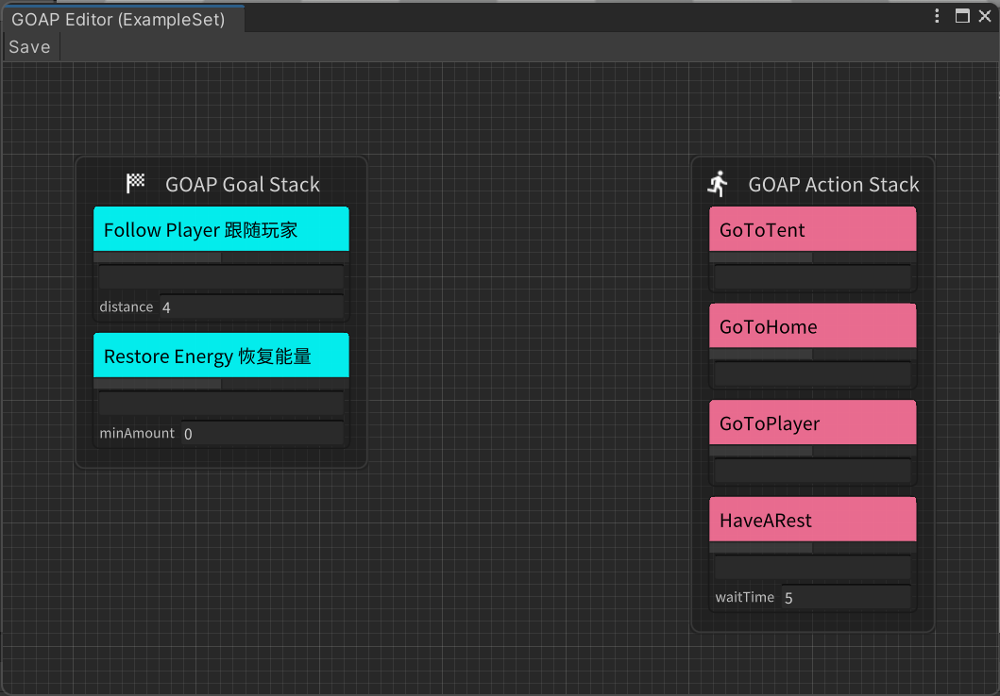
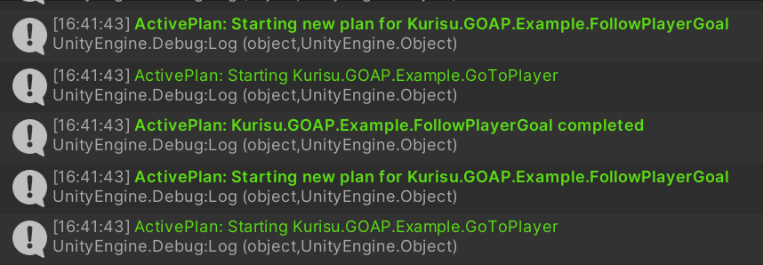

# AkiGOAP

AkiGOAP is a Goal Oriented Action Planner unity plugin that supports visualization, modular editing, and multi-threading, which integrates the functions of multiple open source GOAP plugins.

## Features

1. Two algorithms are implemented
2. Can be accelerated using Job System

3. Visual Graph Editor



- Allow debug in runtime play mode


3. Log detail with customized level



4. Take snapShot of current plan searching


## Supported version

* Unity 2021.3 or Later

## Set Up
1. Using git URL to download package by Unity PackageManager ```https://github.com/AkiKurisu/AkiGOAP.git```

## How to debug
1. Right-click Goal and set Always Banned
2. Right-click Goal and set it to the highest priority (only affects a single Goal)
3. Right-click Action settings to always meet preconditions (Preconditions)

## How To Use

Since the design of GOAP AI requires a certain threshold, I only introduce how to use the core functions of the plugin. For the specific design, please refer to the Example sample provided by the plugin.
1. In the Asset folder, right-click the menu ```Create/AkiGOAP/GOAPSet``` to create a GOAPSet
2. Click ```Open GOAP Editor``` to open the editor
3. Right-click to create a Goal node or Action node, and drag the two nodes into ```GOAP Goal Stack``` and ```Action Stack``` respectively
4. Create a GameObject to mount GOAPPlanner, and also mount GOAPWorldState
5. Write the Agent script, the example is as follows:
    ```c#
    using UnityEngine;
    using UnityEngine.AI;
    using System.Linq;
    namespace Kurisu.GOAP.Example
    {
        public class ExampleAgent : MonoBehaviour
        {
            private IPlanner planner;
            private NavMeshAgent navMeshAgent;
            public NavMeshAgent NavMeshAgent=>navMeshAgent;
            [SerializeField]
            private GOAPSet dataSet;
            [SerializeField]
            internal Transform player;
            public Transform Player=>player;
            private void Start() {
                navMeshAgent=GetComponent<NavMeshAgent>();
                planner=GetComponent<IPlanner>();
                //You can pass inheritance and use Linq's Cast or OfType to get custom subclasses and perform dependency injection
                var goals=dataSet.GetGoals();
                foreach(var goal in goals.OfType<ExampleGoal>())
                {
                    goal.Inject(this);
                }
                var actions=dataSet.GetActions();
                foreach(var action in actions.OfType<ExampleAction>())
                {
                    action.Inject(this);
                }
                //Finally you need to inject Goal and Action into Planner
                planner.InjectGoals(goals);
                planner.InjectActions(actions);
            }
        }
    }

    ```
6. Mount the Agent script on the GameObject above, and drag in the previously created GOAPSet
7. Click Play, and all Goals and Actions will obtain their dependencies for initialization at Start
8. Click ```Open GOAP Editor``` of GOAPPlanner to open the editor to view the Priority of all current Goals and the Cost of all Actions
9. Click ``Snapshot`` in the upper right corner to open the snapshot to view the current Plan (i.e., a sequence of Actions to reach the current Goal)

## Backend Explanation
There are differences in the implementation of the two algorithms

1. Main Backend, all run on the main thread, suitable for tasks with low complexity, and can reduce overhead through reasonable design of Action. The algorithm is optimized from https://github.com/toastisme/OpenGOAP

2. JobSystem Backend, the algorithm uses https://github.com/crashkonijn/GOAP. The created Job can also add Position to Cost calculation. The usage example is as follows:
    ```C#
    using UnityEngine;
    namespace Kurisu.GOAP.Example
    {
        public class GoToHome : ExampleAction
        {
            protected override void SetupDerived()
            {
                //Register Transform bound to this node
                worldState.RegisterNodeTarget(this,agent.Home);
            }
        }
    }
    ```
    Features: Add all Goals and Actions to the search graph, and create a Job for each Goal to search for paths. Feed search results based on priority.

3. Regarding ```TickType``` of GOAPPlanner, since GOAP is relatively expensive to use, we can consider turning off the search of Plan when it is not needed. Check ```ManualUpdateGoal``` to change the Goal update to manual call. Check ```ManualActivatePlanner```, the Planner will no longer automatically search for the plan, you need to manually call ```ManualActivate()``` to activate, and the planner will be closed again when it loses the plan for the first time after activation. This option is suitable for some turn-based games. Usually, the AI of these games only needs to search for a plan in a specific round or a specific time period.
   
4. Regarding the ```Skip Search When Action Running``` of `JobSystem Backend`, since planner will obtain the Plan (that is, the Action sequence) of all Goal cases in each frame by default. A typical example is: Goal A needs an item, but gets the item It is necessary to perform the movement behavior B first and then the collection behavior C. After finding that the current Action is B, the AI will perform B. If we want AI to perform acquisition behavior C after B is completed, we should notify Planner to search again or search every frame after B is completed. If this option is checked, Planner will no longer search when it has an Action. You need to let the Action close itself actively, for example, make the Action in a state where the Precondition is not satisfied.