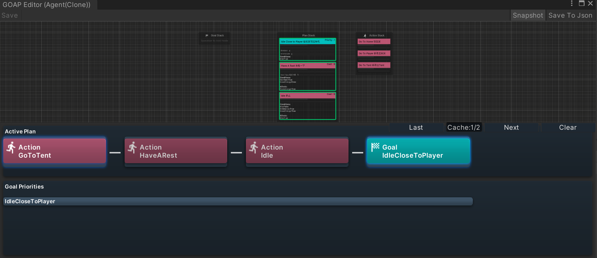
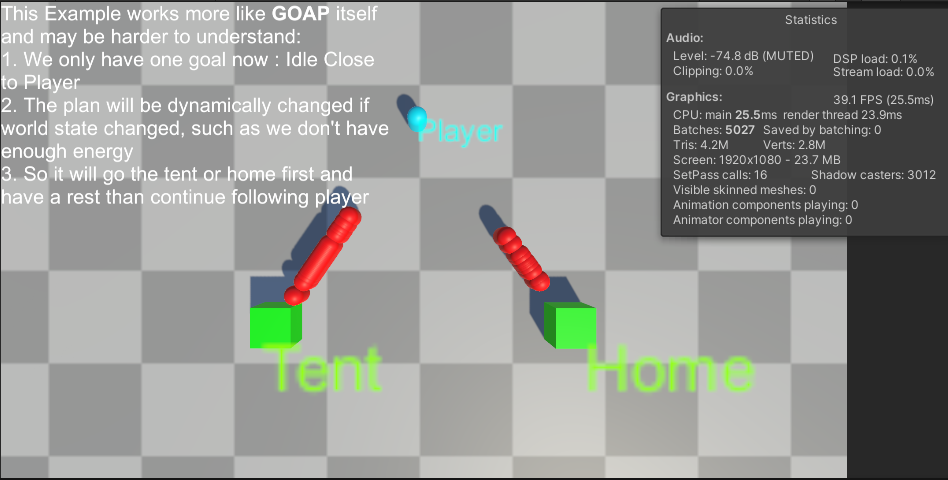

# AkiGOAP

***Read this document in Chinese: [中文文档](./README_ZH.md)***

AkiGOAP is a Goal Oriented Action Planner unity plugin that supports visualization, modular editing, and multi-threading, which integrates the functions of multiple open source GOAP plugins.

## Features

1. Two algorithms are implemented
2. Can be accelerated using Job System

3. Visual Graph Editor


- Allow debug in runtime play mode


3. Log detail with customized level


4. Take snapShot of current plan searching



## Supported version

* Unity 2021.3 or Later

## Set Up
1. Using git URL to download package by Unity PackageManager ```https://github.com/AkiKurisu/AkiGOAP.git```

## How to debug
1. Right-click Goal and set Always Banned
2. Right-click Goal and set it to the highest priority (only affects a single Goal)
3. Right-click Action settings to always meet preconditions (Preconditions)

## How To Use

***Recommended to play the Samples/Example scene first***
1. In the Asset folder, right-click the menu ```Create/AkiGOAP/GOAPSet``` to create a GOAPSet
2. Click ```Open GOAP Editor``` to open the editor
3. Right-click to create a Goal node or Action node, and drag the two nodes into ```GOAP Goal Stack``` and ```Action Stack``` respectively
4. Create a GameObject to mount GOAPPlanner, and also mount GOAPWorldState
5. Write the Agent script, the example is as follows:
    ```c#
    using UnityEngine;
    using UnityEngine.AI;
    using System.Linq;
    namespace Kurisu.GOAP.Example
    {
        public class ExampleAgent : MonoBehaviour
        {
            private IPlanner planner;
            private NavMeshAgent navMeshAgent;
            public NavMeshAgent NavMeshAgent=>navMeshAgent;
            [SerializeField]
            private GOAPSet dataSet;
            [SerializeField]
            internal Transform player;
            public Transform Player=>player;
            private void Start() {
                navMeshAgent=GetComponent<NavMeshAgent>();
                planner=GetComponent<IPlanner>();
                //You can pass inheritance and use Linq's Cast or OfType to get custom subclasses and perform dependency injection
                var goals=dataSet.GetGoals();
                foreach(var goal in goals.OfType<ExampleGoal>())
                {
                    goal.Inject(this);
                }
                var actions=dataSet.GetActions();
                foreach(var action in actions.OfType<ExampleAction>())
                {
                    action.Inject(this);
                }
                //Finally you need to inject Goal and Action into Planner
                planner.InjectGoals(goals);
                planner.InjectActions(actions);
            }
        }
    }

    ```
6. Mount the Agent script on the GameObject above, and drag in the previously created GOAPSet
7. Click Play, and all Goals and Actions will obtain their dependencies for initialization at Start
8. Click ```Open GOAP Editor``` of GOAPPlanner to open the editor to view the Priority of all current Goals and the Cost of all Actions
9. Click ``Snapshot`` in the upper right corner to open the snapshot to view the current Plan (i.e., a sequence of Actions to reach the current Goal)

## Backend Explanation
There are differences in the implementation of the two algorithms

1. Main Backend, all run on the main thread, suitable for all types of tasks, Position can be added to Cost calculation, algorithm optimization and improvement from https://github.com/toastisme/OpenGOAP

2. JobSystem Backend, the algorithm uses https://github.com/crashkonijn/GOAP. The created Job can also add Position to Cost calculation, but there are certain restrictions on applicable tasks. For details, see [JobSystemBackend Limitations](#jobsystembackend-limitations)
```C#
using UnityEngine;
namespace Kurisu.GOAP.Example
{
    public class GoToHome : ExampleAction
    {
        protected override void SetupDerived()
        {
            //Register Transform bound to this node
            worldState.RegisterNodeTarget(this,agent.Home);
        }
    }
}
```

## How to optimize performance

### Adjust ```TickType```

Since GOAP is relatively expensive to use, we can consider turning off Plan search when it is not needed. 

Check ```ManualUpdateGoal``` to change Goal updates to manual calls. If ```ManualActivatePlanner``` is checked, the Planner will no longer automatically search for Plan and needs to be manually activated by calling ```ManualActivate()```, and the Planner will close again when it loses the Plan for the first time after activation. This option is suitable for some turn-based games. Usually the AI of these games only needs to search for plans in a specific round or a specific time period.

### Adjust ```SearchMode```
   
For example: Target A needs an item, and to obtain the item, you need to first perform <b>Move Action B</b> and then perform <b>Collect Action C</b>. After the Planner searches that the current Action is B, the AI will perform Action B.

If we want the AI to collect behavior C after B is completed, we should notify the Planner to search again after B is completed or search every frame.

The default `SearchMode` of the Planner in AkiGOAP is `Always`, which means it will search every frame. If the searched Plan does not match the current Plan, it will be replaced. You can adjust Planner's search timing by modifying `SearchMode`. If you use `OnActionComplete`, Planner will search again after Action completes or fails. If you use `OnPlanComplete`, Planner will search again after Plan completes or fails. Otherwise, it will It will be executed sequentially according to the current Plan after the Action completes or fails.


* Performance comparison example of Example scene (taking `JobSystemBackend` as an example)
    
     `SearchMode` uses `Always`
     

     `SearchMode` uses `OnActionComplete` or `OnPlanComplete`

     

## JobSystemBackend Limitations

Assume a scenario

Goal is to make an apple pie (HasApplePie:√)

The Conditions and Effects of available Actions are as follows:

1. Walk to the apple tree and pick apples

     <b>Effects:</b> HasApple:√

2. Go to the kitchen

     <b>Effects:</b> InKitchen:√

3. Make apple pie

     <b>Conditions:</b> InKitchen:√ , HasApple:√

     <b>Effects:</b> HasApplePie:√

The current status is

- HasApple:×, HasApplePie:×, InKitchen:×


The theoretical plan is: walk to the [Walk to the apple tree and pick apples] => [Go to the kitchen] => [Make apple pie]

However, the Plan given by the algorithm of `JobSystemBackend` is [Go to the kitchen] => [Make apple pie], which obviously cannot satisfy the Goal.

### Why is there this problem

The algorithm of `JobSystemBackend` stores whether all Actions can be entered (``IsExecutable``) in advance before path search, and does not consider the impact caused by the superposition of Conditions during path search, such as the Conditions in path "[Go to the kitchen] => [Make apple pie]" are actually "InKitchen:√ , HasApple:√" instead of the Conditions of [Go to the kitchen], so the wrong path was found.

### How to fix

Use `MainBackend` or add Conditions. For example, change the Conditions of [Go to the kitchen] to "HasApple:√"