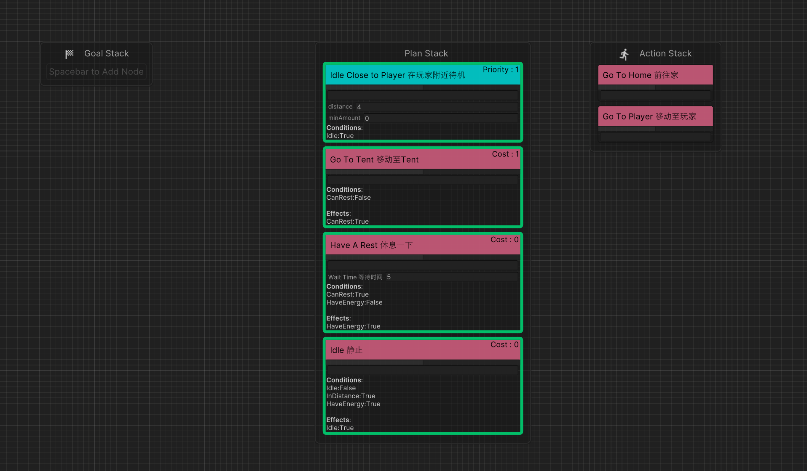

# AkiGOAP

***Read this document in English: [English Document](./README.md)***

AkiGOAP是一个支持可视化、模块化编辑，支持多线程的Goal Oriented Action Planner（目标导向的行为规划）Unity插件，同时集成了多个开源GOAP插件的功能。

AkiGOAP is a Goal Oriented Action Planner unity plugin that supports visualization, modular editing, and multi-threading, which integrates the functions of multiple open source GOAP plugins.
## 特点 Features

1. 包括两种算法实现
2. 可使用Job System加速

3. 可视化编辑器


- 支持Runtime时Debug



3. 自定义输出决策细节


4. 决策快照


## 支持的版本

* Unity 2021.3 or Later

## 安装
1. 在Unity PackageManager中输入Git URL下载 ```https://github.com/AkiKurisu/AkiGOAP.git```

## 如何调试
1. 右键Goal设置禁用
2. 右键Goal设置为最高优先级（仅作用于单个Goal）
3. 右键Action设置始终满足预先条件（Preconditions）

## 如何使用

***推荐先游玩Samples/Example场景***

1. 在Asset文件夹内右键菜单```Create/AkiGOAP/GOAPSet```创建GOAPSet
2. 点击```Open GOAP Editor```打开编辑器
3. 右键创建Goal结点或Action结点，将两种结点分别拖入```GOAP Goal Stack```和```Action Stack```中
4. 创建GameObject挂载GOAPPlanner，同时会挂载WorldState
5. 编写Agent脚本，示例如下：
    ```c#
    using UnityEngine;
    using UnityEngine.AI;
    using System.Linq;
    namespace Kurisu.GOAP.Example
    {
        public class ExampleAgent : MonoBehaviour
        {
            private IPlanner planner;
            private NavMeshAgent navMeshAgent;
            public NavMeshAgent NavMeshAgent=>navMeshAgent;
            [SerializeField]
            private GOAPSet dataSet;
            [SerializeField]
            internal Transform player;
            public Transform Player=>player;
            private void Start() {
                navMeshAgent=GetComponent<NavMeshAgent>();
                planner=GetComponent<IPlanner>();
                //你可以通关继承并使用Linq的Cast或OfType获取自定义的子类并进行依赖的注入
                var goals=dataSet.GetGoals();
                foreach(var goal in goals.OfType<ExampleGoal>())
                {
                    goal.Inject(this);
                }
                var actions=dataSet.GetActions();
                foreach(var action in actions.OfType<ExampleAction>())
                {
                    action.Inject(this);
                }
                //最后你需要将Goal和Action注入Planner中
                planner.InjectGoals(goals);
                planner.InjectActions(actions);
            }
        }
    }

    ```
6. 在上述GameObejct上挂载Agent脚本，并拖入之前制作的GOAPSet
7. 点击Play，在Start时所有Goal和Action均会获取其依赖进行初始化
8. 点击GOAPPlanner的```Open GOAP Editor```打开编辑器查看当前所有Goal的Priority优先级和所有Action的Cost代价
9. 点击右上角的```Snapshot```打开快照查看当前的Plan计划（即抵达当前Goal的一串Action序列）

## Backend说明

两种算法实现上有所差异

1. Main Backend，全部运行在主线程上，适用于全部类型的任务，可以将Position加入Cost计算，算法优化和改进自 https://github.com/toastisme/OpenGOAP 

2. JobSystem Backend，算法使用 https://github.com/crashkonijn/GOAP ，创建的Job可以同时将Position加入Cost计算，但适用的任务有一定限制，详见[JobSystemBackend限制](#jobsystembackend限制)
   
### Position计算样例如下：
```C#
using UnityEngine;
namespace Kurisu.GOAP.Example
{
    public class GoToHome : ExampleAction
    {
        protected override void SetupDerived()
        {
            //注册该结点所绑定的Transform
            worldState.RegisterNodeTarget(this,agent.Home);
        }
    }
}
```

## 如何优化性能

### 调整```TickType```

由于GOAP使用比较费性能，我们可以考虑手动启用Plan的搜索。

勾选```ManualUpdateGoal```则Goal的更新都变更为手动调用。勾选```ManualActivatePlanner```则Planner不再自动搜索Plan，需要手动调用```ManualActivate()```激活，并且Planner在激活后第一次失去Plan时再次关闭。该选项适用于一些回合制游戏，通常这些游戏的AI仅需在特定回合或特定时间段进行Plan的搜索。
### 调整```SearchMode```
   
举例：目标A需要一个物品，而获得物品需要先进行<b>移动行为B</b>再进行<b>采集行为C</b>。Planner搜索到当前的Action为B后，AI将进行B行为。

如果要让AI在B完成后进行采集行为C，我们应当在B完成后通知Planner重新搜索或者每帧进行搜索。

AkiGOAP中Planner默认的`SearchMode`为`Always`即会在每帧进行搜索，如果搜索出的Plan与当前Plan不符则被替代。你可以通过修改`SearchMode`来调整Planner的搜索时机,如果使用`OnActionComplete`,Planner则在Action完成或失败后重新搜索，如果使用`OnPlanComplete`,Planner则在Plan完成或失败后重新搜索，否则就会在Action完成或失败后根据当前Plan依次执行。


* Example场景的性能对比示例(以`JobSystemBackend`为例)
    
    `SearchMode`使用`Always`
    

    `SearchMode`使用`OnActionComplete`或`OnPlanComplete`

    

## JobSystemBackend限制

假设一个场景

Goal为制作一个苹果派（HasApplePie:√）

可用Actions的Conditions和Effects如下：

1. 走到苹果树采苹果

    <b>Effects:</b> HasApple:√

2. 走到厨房

    <b>Effects:</b> InKitchen:√

3. 制作苹果派

    <b>Conditions:</b> InKitchen:√ , HasApple:√

    <b>Effects:</b> HasApplePie:√

当前状态为

- HasApple:×, HasApplePie:×, InKitchen:×


理论上的Plan为：走到【苹果树采苹果】=>【走到厨房】=>【制作苹果派】

但`JobSystemBackend`的算法给出的Plan为【走到厨房】=>【制作苹果派】，显然是无法满足Goal的。

### 为什么会有这个问题

`JobSystemBackend`的算法将所有Action是否可以进入(``IsExecutable``)在路径搜索前提前存储，没有考虑路径搜索时Conditions的叠加导致的影响，例如路径“【走到厨房】=>【制作苹果派】”中Conditions实际为“InKitchen:√ , HasApple:√”而非【走到厨房】的Conditions，因此找到了错误的路径。

### 如何修复

使用`MainBackend`或增加Conditions例如【走到厨房】的Conditions修改为“HasApple:√”